# Understanding Next.js Patterns and Best Practices

In modern web development, understanding patterns and best practices is crucial for building efficient, maintainable, and user-friendly applications. Let's explore some key concepts in Next.js and React development.

## Server-Side Rendering (SSR) in Next.js

Server-Side Rendering is a crucial feature in Next.js that significantly impacts performance and user experience. Let's break down how it works:

### The SSR Process


1. **Initial Request**
   - User requests a page
   - Server processes React components
   - Generates complete HTML
   - Sends HTML to browser
   - JavaScript "hydrates" the page for interactivity

2. **Code Implementation**
   ```tsx
   // pages/index.tsx
   // Notice: No "use client" directive - server-rendered by default
   import { allPosts } from 'contentlayer/generated'
   
   export default function HomePage() {
     // Data fetching happens on server
     const posts = allPosts.sort((a, b) => 
       new Date(b.date).getTime() - new Date(a.date).getTime()
     )
     
     return (
       <div>
         {posts.map(post => (
           <PostCard key={post._id} post={post} />
         ))}
       </div>
     )
   }
   ```

### Benefits of SSR

1. **Performance**
   ```mermaid
   graph LR
       A[Client Request] --> B[Server Render]
       B --> C[HTML Response]
       C --> D[Quick Display]
       D --> E[JS Hydration]
   ```
   - Faster initial page load
   - Reduced client-side processing
   - Better Time to First Contentful Paint (FCP)
   - Typical improvement: 30-50% faster FCP

2. **SEO Optimization**
   - Search engines see complete content
   - Better indexing of dynamic content
   - Improved crawlability
   - Higher search engine rankings

3. **Device Compatibility**
   - Better performance on low-powered devices
   - Reduced client-side JavaScript processing
   - More consistent experience across devices

## Context Pattern in React

The Context pattern is a powerful way to manage state and share data in React applications.

### Understanding Context

1. **Purpose**
   ```tsx
   // context/ColorContext.tsx
   import { createContext, useContext } from 'react'
   
   const ColorContext = createContext<ColorContextType | undefined>(undefined)
   
   export function useColors() {
     const context = useContext(ColorContext)
     if (context === undefined) {
       throw new Error('useColors must be used within a ColorProvider')
     }
     return context
   }
   ```

2. **Real-World Example**
   ```tsx
   // Example from our blog's color theming
   const PostCard = ({ post }) => {
     const { categoryStyles } = useColors()
     const styles = categoryStyles[post.category]
     
     return (
       <article className={`
         ${styles.bg}
         ${styles.text}
         transition-colors duration-200
       `}>
         <h2 className={styles.accent}>{post.title}</h2>
         <p className={styles.text}>{post.summary}</p>
       </article>
     )
   }
   ```

### TypeScript Best Practices: undefined vs null

Understanding the distinction between `undefined` and `null` is crucial in TypeScript:

```typescript
// Type Definition Example
type CategoryStyle = {
  bg: string
  text: string
  accent: string
  hover: string
}

// Good Practice - Undefined for uninitialized state
type ColorContextType = {
  styles: CategoryStyle | undefined
  setStyle: (style: CategoryStyle) => void
}

// Less Ideal - Null for missing value
type ColorContextType = {
  styles: CategoryStyle | null
  setStyle: (style: CategoryStyle) => void
}
```

## UI Pattern: Progressive Disclosure

Progressive Disclosure is a UI pattern that helps manage cognitive load and improve user experience.

### Implementation Example

```tsx
const CategoryList = () => {
  const [showAll, setShowAll] = useState(false)
  const [visibleCategories, setVisibleCategories] = useState(4)

  // Performance optimization with useMemo
  const sortedCategories = useMemo(() => 
    categories.sort((a, b) => b.count - a.count),
    [categories]
  )

  return (
    <div>
      {sortedCategories
        .slice(0, visibleCategories)
        .map(category => (
          <CategoryItem 
            key={category.slug} 
            {...category}
            className="animate-fade-in" 
          />
        ))}
      <button 
        onClick={() => {
          setShowAll(!showAll)
          setVisibleCategories(showAll ? 4 : categories.length)
        }}
        className="transition-transform hover:scale-105"
      >
        {showAll ? 'Show Less' : '...'}
      </button>
    </div>
  )
}
```

### Performance Metrics

```mermaid
graph TD
    A[Initial Load] --> B[4 Categories]
    B --> C{User Clicks More}
    C -->|Yes| D[Load All]
    C -->|No| E[Stay Minimal]
    D --> F[Memory Usage ↑]
    E --> G[Memory Usage =]
```



## Common Questions and Best Practices

### PostCard Component Patterns

1. **Text Truncation with HTML Entities**
   ```tsx
   function truncateAtWord(text: string, maxLength: number) {
     if (text.length <= maxLength) return text
     const truncated = text.substring(0, text.lastIndexOf(' ', maxLength))
     return `${truncated.replace(/[,;.]$/, '')}&hellip;`
   }
   ```

2. **Advanced Color Context Usage**
   ```tsx
   const PostCard = ({ post }) => {
     const { categoryStyles, isDarkMode } = useColors()
     const styles = categoryStyles[post.category]
     
     return (
       <article 
         className={clsx(
           styles.bg,
           styles.text,
           isDarkMode && 'opacity-90',
           'transition-all duration-300'
         )}
       >
         {/* Content */}
       </article>
     )
   }
   ```

3. **Enhanced Group Pattern with Animations**
   ```tsx
   <div className="group relative overflow-hidden">
     <h2 className="
       group-hover:text-blue-500
       transition-colors duration-300
       ease-in-out
     ">
       {post.title}
     </h2>
     <div className="
       absolute inset-0 
       bg-gradient-to-r from-blue-500/10
       scale-x-0 group-hover:scale-x-100
       transition-transform duration-300
       origin-left
     "/>
   </div>
   ```

### Layout and Styling Best Practices

1. **Responsive Grid System**
   ```tsx
   <div className="
     grid
     grid-cols-1 
     md:grid-cols-2 
     lg:grid-cols-3 
     gap-4
     md:gap-6
     lg:gap-8
     p-4
     md:p-6
     auto-rows-max
   ">
     <div className="lg:col-span-2">
       {/* Main content */}
     </div>
     <div className="lg:sticky lg:top-4 lg:h-fit">
       {/* Sidebar */}
     </div>
   </div>
   ```

2. **Optimized Image Loading**
   ```tsx
   <div className="
     aspect-video
     relative
     overflow-hidden
     rounded-lg
     shadow-lg
   ">
     <Image 
       fill
       src={image} 
       alt={title}
       sizes="(max-width: 768px) 100vw,
              (max-width: 1200px) 50vw,
              33vw"
       className="
         object-cover
         transition-transform
         duration-300
         hover:scale-105
       "
       priority={isPriority}
     />
   </div>
   ```

## Performance Considerations

### Component Optimization

1. **Memoization**
   ```tsx
   const MemoizedPostCard = memo(PostCard, (prev, next) => {
     return (
       prev.id === next.id &&
       prev.category === next.category &&
       prev.lastModified === next.lastModified
     )
   })
   ```

2. **Lazy Loading**
   ```tsx
   const DynamicChart = dynamic(() => import('./Chart'), {
     loading: () => <ChartSkeleton />,
     ssr: false
   })
   ```

## Conclusion

Understanding these patterns and best practices is crucial for building robust Next.js applications. They help create better user experiences, maintain clean code, and ensure optimal performance across different devices and contexts.

Remember that patterns should be applied thoughtfully based on your specific use case. Not every pattern is necessary for every situation, but having them in your toolkit helps make better architectural decisions.

### Key Takeaways

1. Use SSR strategically for performance and SEO
2. Implement Context pattern for clean state management
3. Apply Progressive Disclosure for better UX
4. Optimize components for performance
5. Follow TypeScript best practices for type safety

Now that you understand these patterns, you can implement them in your own Next.js applications to create more efficient and maintainable code. 